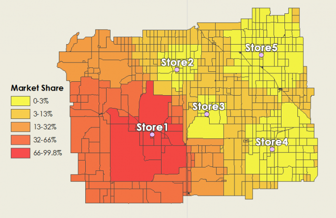

# Catchment Area Analytics
## Built with
- Python

## Background
Understanding the catchment area of a store is crucial for retail businesses to make informed decisions about store locations, marketing strategies, and resource allocation. Traditionally, catchment area analysis has relied on methods like the Huff Gravity Model, which estimates the probability of consumers patronizing a store based on distance and attractiveness factors. However, advancements in research have led to the development of enhanced models that offer greater accuracy and precision in catchment area prediction.

## Description

Reference image [1] showing model outcomes: the catchment area of a store. 

This project addresses the need for more sophisticated catchment area analysis by designing and implementing an enhanced version of the Huff Gravity Model. Drawing from methodologies outlined in cutting-edge research papers, the project utilizes Python to develop a robust analytical framework.

Key features of the project include the quantification of store location attractiveness for footfall predictions. By integrating various factors such as proximity to points of interest, store area, accessibility, and local population demographics, the model provides a comprehensive understanding of store attractiveness within its catchment area.

Through quantitative modeling and analysis, the project enables retail businesses to make data-driven decisions regarding store locations, marketing strategies, and resource allocation. Ultimately, the project empowers businesses to optimize their operations and enhance their competitiveness in the retail market.

## References
[1] https://gisgeography.com/huff-gravity-model/