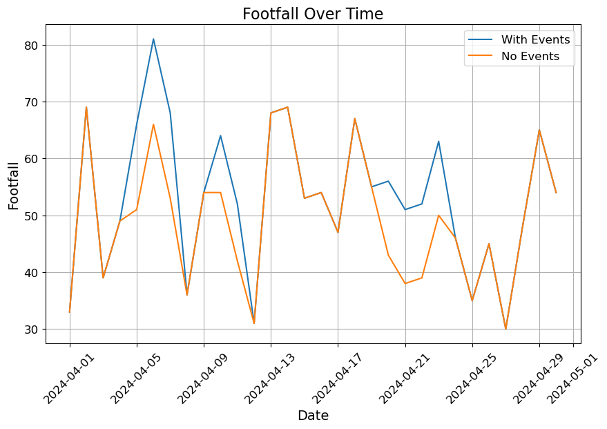

# Marketing Event Uplift Modelling
## Built with
- Python

## Background
Understanding the impact of marketing events on footfall is crucial for businesses aiming to optimize their marketing strategies and maximize return on investment (ROI). By accurately quantifying the footfall uplift generated by various marketing initiatives, businesses can make data-driven decisions to allocate resources effectively and improve overall marketing effectiveness.

Traditional marketing attribution models often struggle to capture the complex and nonlinear relationships between marketing events and foot traffic. As a result, there is a growing need for advanced analytical techniques, such as Marketing Mix Modelling (MMM), to provide more accurate insights into the effectiveness of marketing campaigns.

## Description

Example image showing model outcomes: footfall with and without events.

This project addresses this need by adapting and implementing MMM to specifically focus on quantifying the footfall uplift from marketing events. In addition to adaptation and implementation, enhancements to the MMM have resulted in a 20% performance boost through optimizing models tailored to diverse event characteristics.

Ultimately, analysis of the model outcomes will equip businesses with actionable insights to refine and optimize their marketing strategies, leading to improved customer engagement, increased footfall, and enhanced overall business performance.