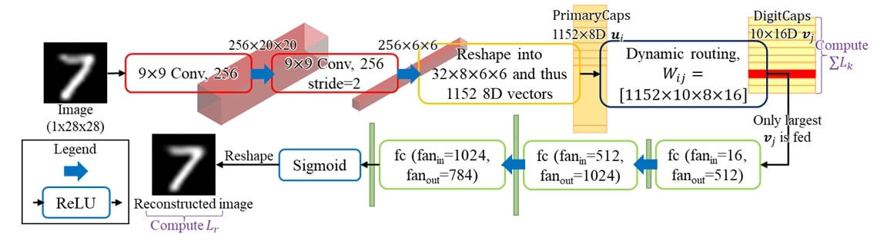
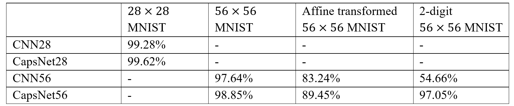

# Investigating the Performance of a Capsule Network in Digit Classification Task
## Built with
- Python
- PyTorch

## Achievements
- Designed and conducted experiments to showcase Capsule Network effectiveness in multi-label image classification using Python and Pytorch

## Background and Description
Hinton et al. [1] and Sabour et al. [2] presented capsule network with dynamic routing, an approach closer to replicating the human vision, to resolve the fundamental limitations of CNNs: translational equivariance [3], no build-in understanding of 3D space, and Picasso problem [4]. 

This project designed and conducted experiments to demonstrate the effectiveness of a Capsule Network (CapsNet) in a multi-label image classification task that was not addressed in the original paper. The code is based on [XifengGuo/CapsNet-PyTorch](https://github.com/XifengGuo/CapsNet-PyTorch).

## Results

All networks have been trained solely on MNIST or padded MNIST. However, CapsNet is capable of performing multi-label image classification despite being trained exclusively on single-label images.

## References
[1] G. E. Hinton, A. Krizhevsky, and S. D. Wang, “Transforming Auto-Encoders,” in  International conference on artificial neural network, 2011, pp. 44-51, doi:  10.1007/978-3-642-21735-7_6. 

[2] S. Sabour, N. Frosst, and G. E. Hinton, “Dynamic routing between capsules,” in Advances in neural information processing systems 30, 2017.

[3] L. Alzubaidi et al., “Review of deep learning: concepts, CNN architectures, challenges, applications, future directions,” Journal of Big 
Data, vol. 8, no. 53, Mar. 2021. 

[4] J. D. Kelleher, “The Future of Deep Learning,” in Deep Learning. Cambridge, U.S: MIT Press, 2019.

