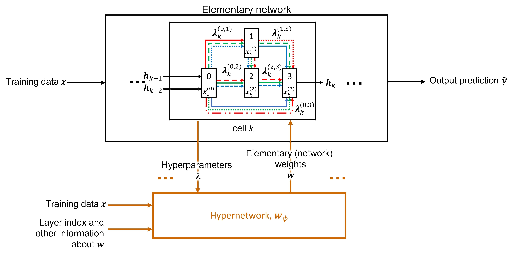
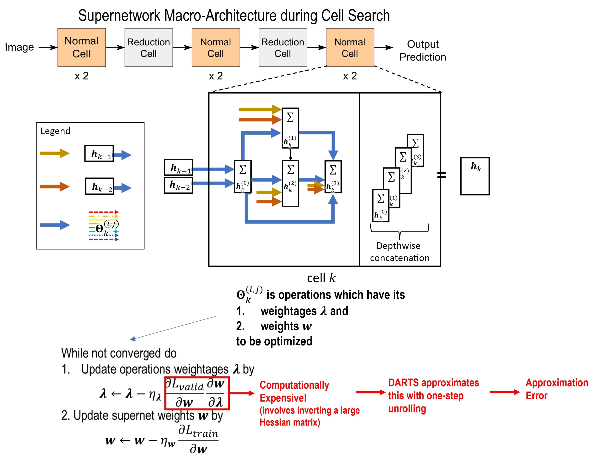
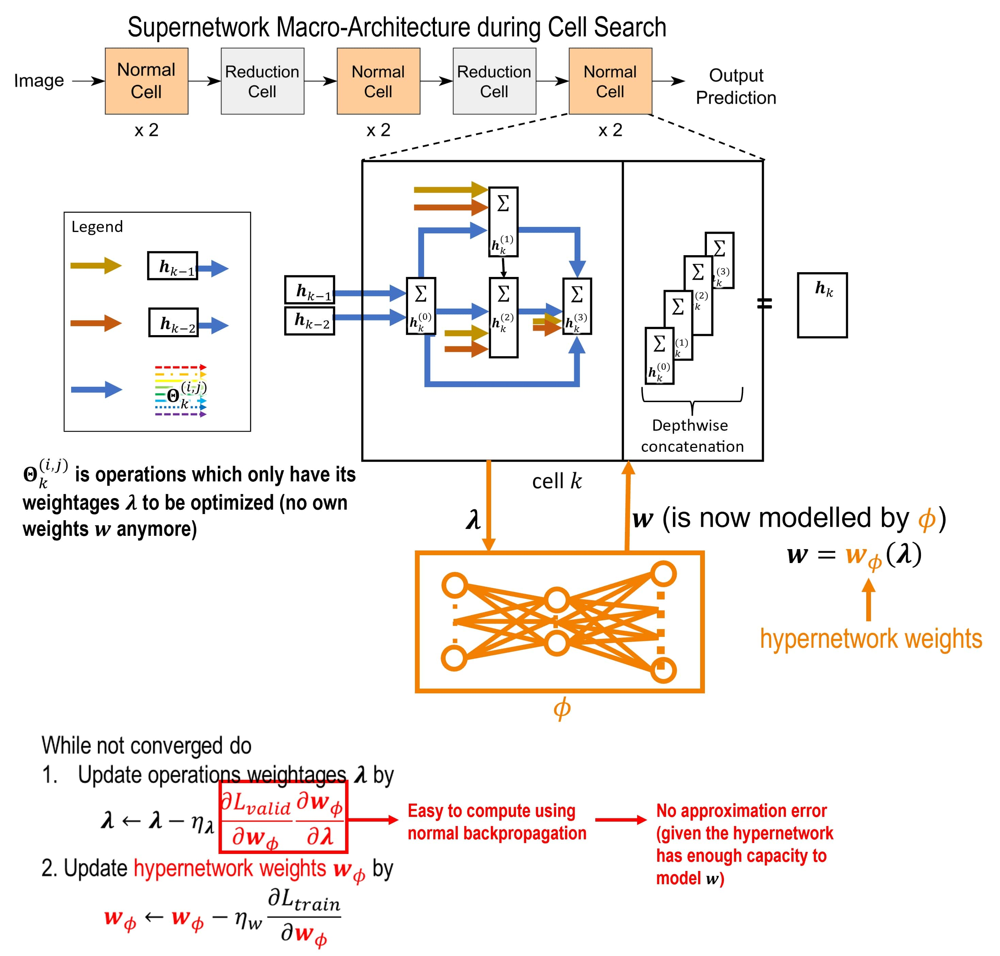

# Differentiable Neural Architecture Search through a Hypernetwork For Image Recognition
## Built with
- Python
- PyTorch

## Achievements
- Designed and implemented a novel NAS network by integrating hypernetworks for hyperparameter optimization within a differentiable architecture search framework using Python and Pytorch
- Successfully improved the performance of the architecture search for image recognition tasks at a comparable search cost
- Prepared and submitted the manuscript to a scholarly journal, which is currently under review

## Background and Description
Neural Architecture Search (NAS) automates the search for optimal neural network architectures, a process traditionally requiring human expertise and trial-and-error. NAS employs machine learning algorithms to explore a predefined search space, evaluating and comparing architectures based on task performance. It utilizes strategies like reinforcement learning, evolutionary algorithms, or gradient-based optimization to efficiently identify architectures with superior performance. By automating architecture design, NAS accelerates the development of advanced neural networks, propelling AI research and applications.

DARTS (Differentiable Architecture Search) is a gradient-based approach to (NAS). It uses a continuous relaxation of the architecture space, allowing for efficient optimization through backpropagation. By introducing differentiable variables and leveraging the softmax relaxation, DARTS enables joint optimization of architecture and model weights. This approach has proven effective in discovering competitive neural architectures while reducing computational costs. 

DARTS uses unrolling method to approach the bilevel optimization search problem to approximate hypergradient. This project proposes developing a DARTS variant by replacing the unrolling method with a hypernetwork to eliminate the approximation loss and further improve its performance in searching architectures.

Reference Code: https://github.com/khanrc/pt.darts/tree/master (DARTS implementation)

## Overview of HyperDARTS that integrates hypernetworks into DARTS

## DARTS vs. HypereDARTS
### DARTS

### HyperDARTS

# Poster

