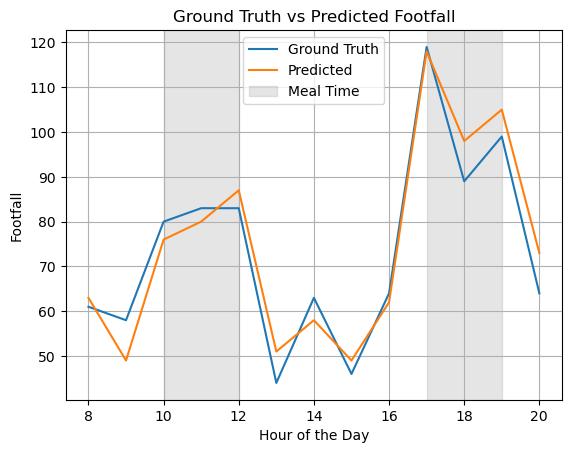

# Footfall Forecasting
## Built with
- Python
- scikit-learn
- NumPy

## Achievements
- Developed footfall forecasting solutions for production use at 3 levels of granularity: daily, hourly, and minutely
- Reduced forecasting error rate by more than 10% through feature engineering and hyperparameter tuning

## Background
Footfall forecasting is vital for businesses to optimize operations, enhance customer experiences, and drive revenue. By accurately predicting visitor traffic, organizations can efficiently allocate resources, minimize wait times, and tailor marketing strategies. Additionally, footfall insights inform safety measures, infrastructure planning, and data-driven decision-making, empowering businesses to thrive in a competitive landscape.

## Description

Fig. 1. Example image showing ground truth and predicted footfall.

The project focused on crafting footfall forecasting solutions to accommodate forecasting demands across three granularities: daily, hourly, and minutely. Specialized models were engineered for each granularity to optimize accuracy and efficiency, as each model has its strengths and weaknesses. For example, minute-level footfall data is sparse and requires a fundamentally different modeling approach compared to hourly and daily data. Through thorough feature engineering and hyperparameter tuning, we achieved a significant reduction in the forecasting error rate by over 10%. The resultant solution consistently delivered low error rates and was well-accepted by customers.