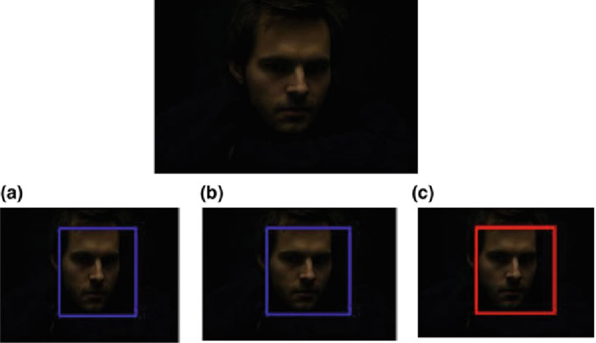

# Low Light Face Recognition
## Built with
- Python
- PyTorch

## Achievements
- Designed and implemented a 2-stage deep learning solution (Low-Light Image Enhancement and Face Recognition) for face recognition under diverse low-light conditions using Pytorch
- Achieved a test precision of 89% and significantly increased face matching speed by integrating Elasticsearch

## Background
Face recognition systems are essential in various applications, but some often struggle under low-light conditions due to reduced image quality and visibility. In real-world scenarios, such as surveillance or nighttime photography, accurately identifying faces becomes challenging. Traditional face recognition models are not optimized for low-light conditions, leading to decreased performance and reliability.

## Description

Fig. 1. Reference image [1] showing low-light face recognition.

This project addresses the need for robust face recognition systems in low-light environments by designing and implementing a 2-stage deep learning solution. Leveraging PyTorch, the project consists of two main stages: Low-Light Image Enhancement and Face Recognition.

In the first stage, the project focuses on enhancing low-light images to improve visibility and image quality using advanced deep learning techniques. Methodologies based on cutting-edge research papers are employed to process low-light images and enhance them for better face recognition accuracy.

In the second stage, the enhanced images undergo face recognition using a model trained specifically for low-light-enhanced facial images. This model is designed to operate effectively under challenging lighting conditions, ensuring reliable performance in real-world scenarios.

During testing and evaluation, conducted under a tight schedule, the project achieves a test precision of 89%. This result demonstrates the effectiveness of the system in accurately recognizing faces under low-light conditions. Additionally, the integration of Elasticsearch significantly enhances face matching speed, making the system suitable for real-time applications such as surveillance and security.

Overall, this project provides a robust solution for face recognition in challenging low-light environments, offering improved accuracy, reliability, and speed in face matching tasks.

## References
[1] https://www.researchgate.net/figure/Sample-image-to-detect-face-in-low-light-a-Face-detection-using-Haar-cascade-classifier_fig4_337653929