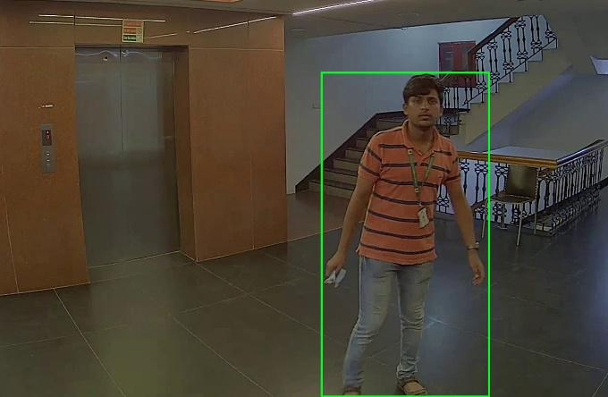

# Video Detection and Tracking for Employees with Staff Tag

## Built with
- Python
- PyTorch

## Achievements
- Designed and implemented a 3-stage deep learning solution (Human Detection, Staff Tag Classification, and Human Tracking), for detecting and tracking an employee with staff tag in a video using Python and Pytorch
- Achieved a success rate of over 80% with only 1 training video

## Background
Efficiently monitoring and tracking employees within a workspace is essential for ensuring security, safety, and productivity. Traditional methods of employee tracking, such as manual observation or RFID tags, may have limitations in terms of accuracy and real-time monitoring capabilities.

## Description
This project addresses the need for precise and automated employee tracking by implementing a 3-stage deep learning solution tailored for video detection and tracking.

Fig. 1. Reference image [1] showing video detection and tracking for employees with staff tag.

### Stage 1: Human Detection
In the initial stage, the project utilizes deep learning techniques to detect human figures within a video stream. This stage serves as the foundation for subsequent steps by accurately identifying individuals present in the video.

### Stage 2: Staff Tag Classification
Once humans are detected, the system identifies employees wearing staff tags by classifying the presence of these tags. This stage distinguishes between regular individuals and employees, allowing for targeted tracking of staff members.

### Stage 3: Human Tracking
Finally, the system tracks the movements of employees with staff tags throughout the video sequence. By continuously monitoring their positions and trajectories, the system enables real-time tracking of staff members within the workspace.

By successfully implementing these stages, the project achieves a high success rate of over 80% with just one training video. This demonstrates the effectiveness of the deep learning solution in accurately detecting and tracking employees with staff tags, providing businesses with enhanced security and operational insights.

## References
[1] https://visailabs.com/an-overview-of-people-human-tracking-methodologies/

