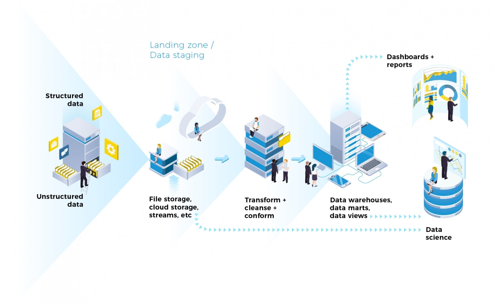

# Data Pipeline Development and Maintenance
## Built with
- ThingsBoard
- Python
- Apache Airflow
- Apache Kafka
- SQL

## Achievements
- Designed and implemented real-time and batch data processing algorithms for analytics on customer journey, returning customer rates, dwell time, and occupancy levels
- Constructed a robust data pipeline in production using ThingsBoard, Python, Apache Airflow, Apache Kafka, and SQL

## Background
In today's data-driven world, businesses rely heavily on data pipelines to collect, process, and analyze vast amounts of data for decision-making and business intelligence purposes. A well-designed and maintained data pipeline is essential for ensuring that data flows smoothly from its source to its destination, enabling timely and accurate insights.

## Description

Reference image [1] showing a high-level overview of a data pipeline.

This project focuses on the development and maintenance of a robust data pipeline to support various business intelligence and analytics requirements. The pipeline is designed to handle both real-time and batch data processing, allowing for the analysis of diverse datasets related to customer behavior, journey analytics, returning customer rates, dwell time, occupancy levels, etc.

Key components of the data pipeline include:

- **Real-time and Batch Processing Algorithms**: Developed and implemented algorithms capable of processing data in both real-time and batch modes. These algorithms are crucial for performing analytics on customer journey, returning customer rates, dwell time, and occupancy levels.
- **Technological Stack**: Leveraged a combination of tools and technologies including ThingsBoard, Python, Apache Airflow, Apache Kafka, and SQL to construct a robust data pipeline in production. These technologies provide the necessary infrastructure and capabilities for data ingestion, processing, and storage.
- **End Presentation**: Ensured that data processed through the pipeline is presented effectively for end-users, enabling them to derive actionable insights and make informed decisions. This includes implementing user-friendly dashboards, reports, and visualizations.

By developing and maintaining this data pipeline, businesses can streamline their data processing workflows, improve data quality and reliability, and empower stakeholders with timely and actionable insights for informed decision-making.

## References
[1] https://www.equalexperts.com/blog/our-thinking/what-is-a-data-pipeline/