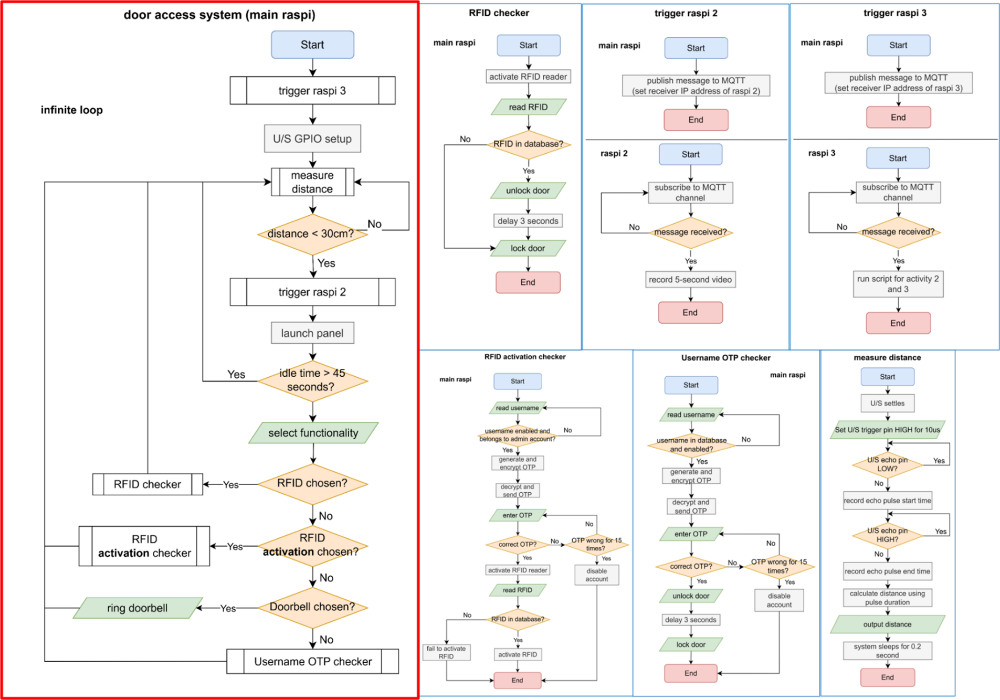
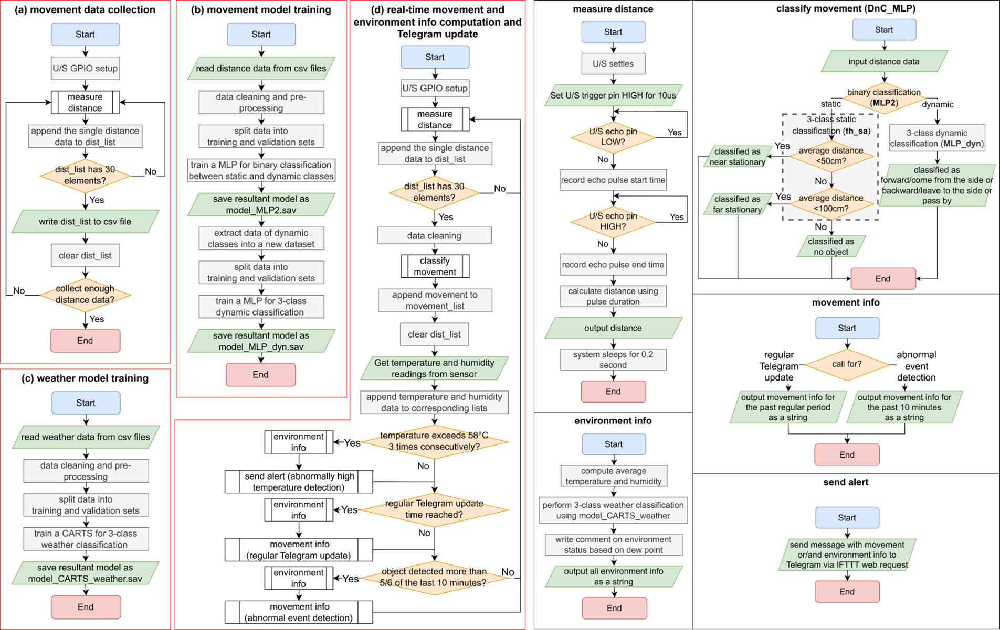
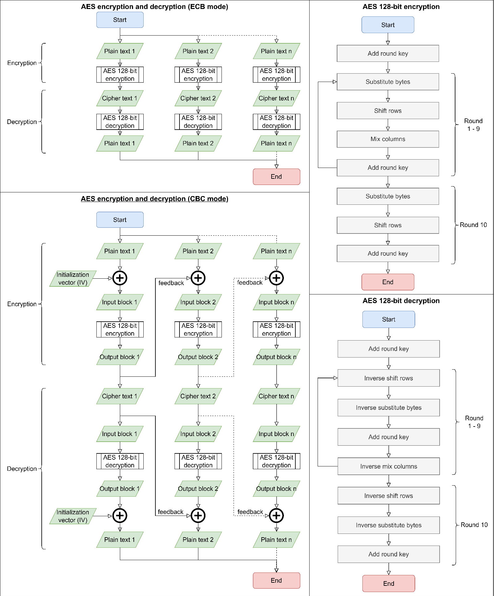
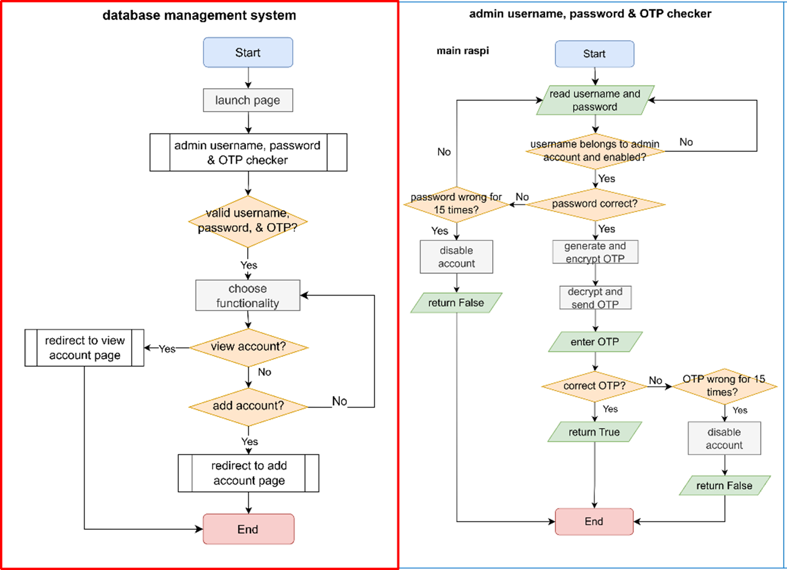
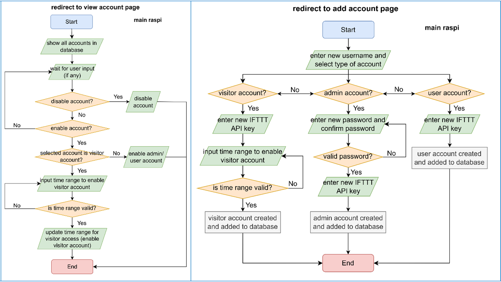

# A Smart Door System
## Built with
- Python
- scikit-learn
- Raspberry Pi
## Achievements
- Developed an IoT-based smart door access control system using Raspberry Pi computers, along with a camera and ultrasonic sensors
- Implemented MLPs for movement detection, achieving a validation accuracy of 97%, and weather classification using sklearn

## Description
This project aims to design a smart door system that can be used to detect presence and authenticate the personnel that want to enter the protected premise. The system has several key features: 
1) IoT Sensor and Network System to Gain Access
2) Machine Learning System for Movement Detection
3) Temperature and Humidity Detection
4) Physical Security Door Lock
5) Security – Encryption and Decryption Algorithm
6) Database management and door access system

## Prototype
Please don't mind the ugly prototype... We rushed it out for demonstration purpose only (aesthetics and tidiness put aside for a moment :D). 

## System Design
### Features 1 and 4: IoT Sensor, Network, and Door Lock System

Main flowchart (left in red frame) and subprocess flowcharts (right in blue frames) for Activities 1 and 4.

### Features 2 and 3: Machine Learning System and Temperature and Humidity

Left in red frames: the 4 main Python files for Activities 2 and 3. Preliminary work: (a), (b), and (c). System execution file: (d). Right in black frames: Subprocesses or functions associated.

### Feature 5: Security – Encryption and Decryption 

Main processes (left) and subprocesses (right) for Activity 5.

### Feature 6: Database management and door access system

Main flowchart (top left in red frame) and subprocess flowcharts (in blue frame) for Activity 6.
