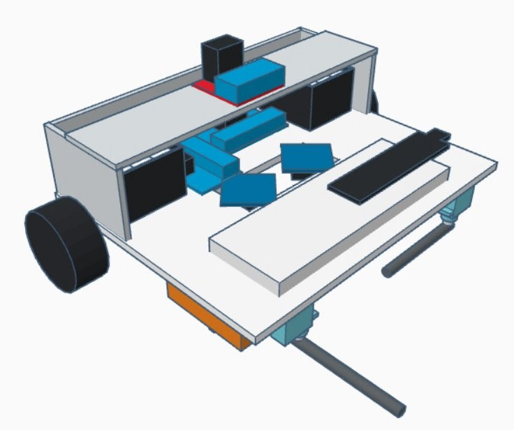
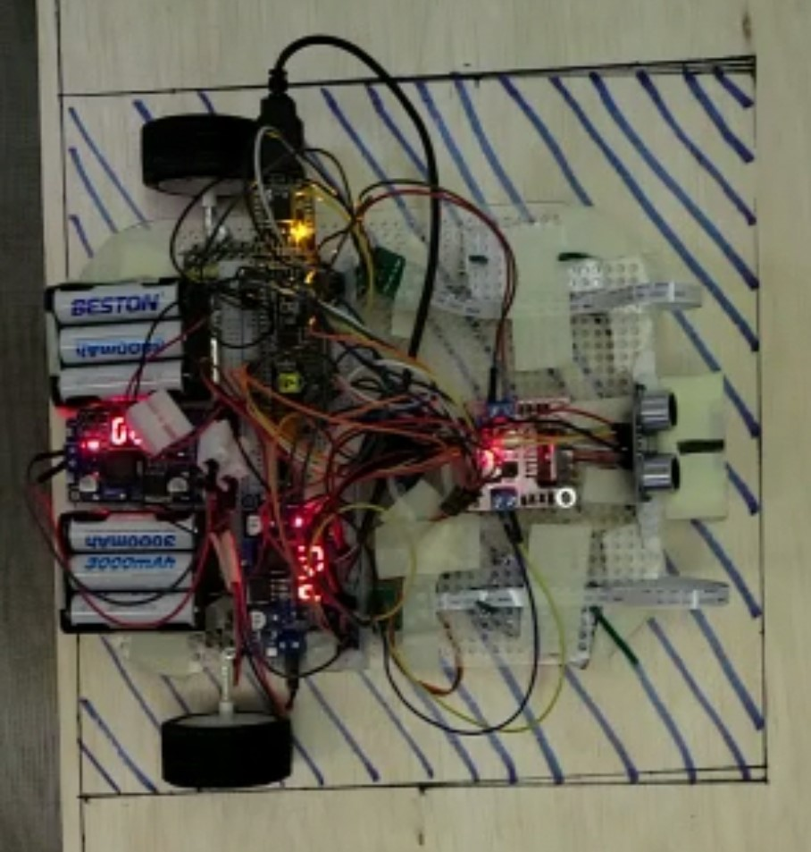

# Autonomous Puck Handling Robot
## Built with
- C
- Programmable System-on-Chip (PSoC)

## Achievements
- Developed a fully autonomous robot capable of identifying puck color and transporting pucks based on their respective colors
- Programmed movement, color sensing, and puck handling functions using C

## Description

## 3D View of the Robot
Details may refer to the Project Report.

## Early Robot
Totally forgot to take a demonstrable photo of the final robot... So here is the very crude early robot :)

