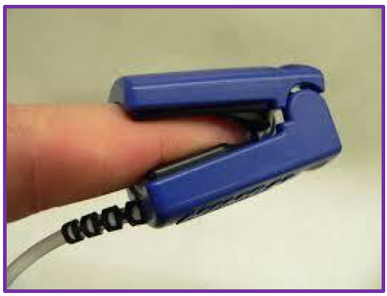
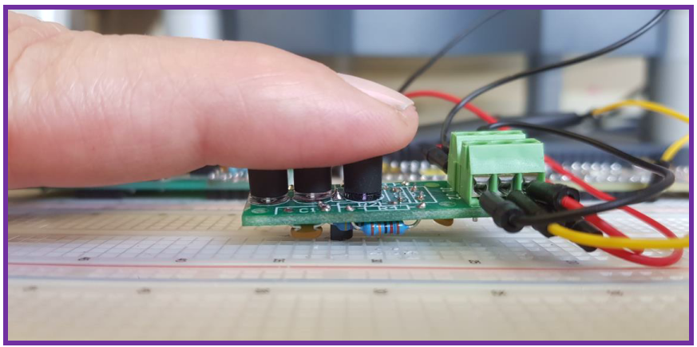
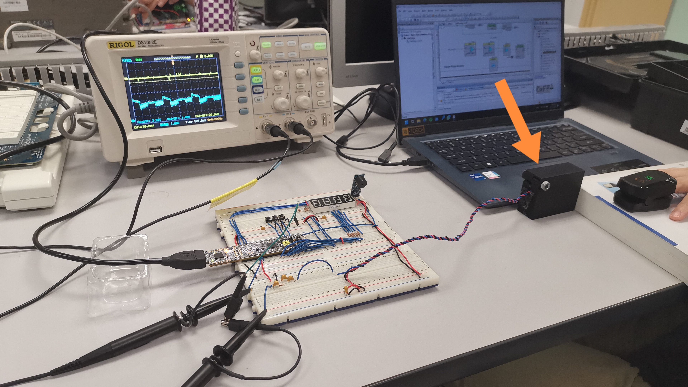

# Heart Rate Monitor
## Built with
- C
- Programmable System-on-Chip (PSoC)

## Achievements
- Created a finger-clip heart rate monitor with over 90% accuracy from (almost) scratch using electronic components, SolidWorks and C

## Description
A heart rate monitor is an instrument that is used to measure your heart rate and to display that information on some form of read out. 

Fig. 1. A commercial finger-clip heart rate monitor.

After completing this project you will:  
1) Have created a “Heart Rate Monitor” that will show your heart rate on a 
display. 
2) Know how to receive and process analog signals from physical world by 
using sensors 
3) Know what 7-segment displays are and how to use them 
4) Know what display multiplexing is and how to apply the concept in your 
circuits   
5) Have improved your skills in prototyping circuits 
6) Have gained some experience in CAD design and 3D printing 
7) Have increased your knowledge of electronic circuits and interfacing with the 
real world

## Prototype

Fig. 2. The finger-clip heart rate monitor in bare form.

 

Fig. 3. The actual setup...
